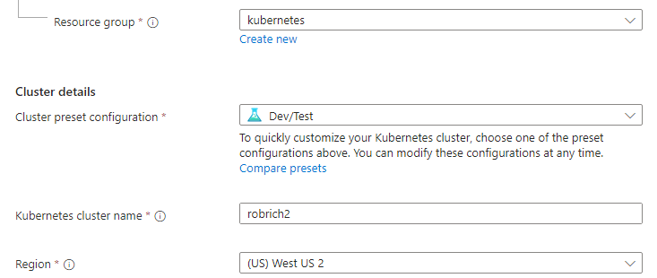

Install Azure resources
=======================


Azure Portal
------------

1. Sign up for a [free Azure trial](https://azure.microsoft.com/en-us/free/).  It requires a credit card for identity verification, but you won't be charged for the content you create.  After your trial, the content will get deleted unless you choose to upgrade to a paid account.

   If you already have an Azure account, you can use that instead.

2. Login to the [Azure Portal](https://portal.azure.com).


Create Azure Container Registry
-------------------------------

Azure Container Registry is like Docker Hub, but the images aren't public to the internet.

(See also https://docs.microsoft.com/en-us/azure/aks/kubernetes-walkthrough-portal.)

1. Click `Create a resource`, type `Container Registry` in the search box at the top, and choose `Container Registry`.

2. Setup the Azure Container Registry with these settings:

   - Create a new Resource Group (easy to delete the whole group at the end)

   - Name the resource group `kubernetes`

   - Pick an Azure region close to you

   - Choose a descriptive name for the Azure Container Registry

   - You can choose to change the SKU to Basic or leave it at Standard.  See also https://docs.microsoft.com/en-us/azure/container-registry/container-registry-skus.

   

3. Push create at the bottom.

4. Once the registry is created, click `Go to Resource` then

   - Switch to the Access Keys tab

   - Enable the Admin user

   - Copy the Admin login and passwords.  We'll need these to login to the docker command-line.

   From this screen, you can also change or disable the passwords.


Create Kubernetes Cluster
-------------------------

1. Click `Create a resource`, type `Kubernetes` in the search box at the top, and choose `Kubernetes Service`.

   

2. In the Basics tab, fill in these options:

   - Use the existing resource group you created above

   - Choose the same location as the container registry

   - Enter a cluster name

   - Choose the region closest to you

   

3. In the Node Pools tab:

   - Change the Node Size to a cheaper VM -- I chose Standard B2s

   - Change the Node count minimum to 1 and maximum to 3

   - Optional: Enable virtual nodes.

     If you need more compute than is available, it'll spill into Azure Container Instances and bill per cpu/ram/second.

   This will be a very under-powered Kubernetes cluster, but it'll also fit nicely in the Azure trial constraints.

4. Optional: In the networking tab:

   - Optional: Edit the DNS name prefix

5. In the Integrations tab, select the container registry created above.  This automatically creates the service principal and access permissions to pull containers from the registry into the cluster.

6. In the Monitoring tab, you can choose to enable monitoring for a nominal cost, or disable it to make the cluster cheaper.  We won't cover monitoring in this workshop.

7. Once you're done customizing the cluster, click the Review and Create tab, then click Create at the bottom.

8. This will take a bit to spin up.  You can watch the progress by clicking "All services" on the top-left.


Configure Cluster
-----------------

When the cluster is fully created, we need to turn on Application Routing

1. In the Azure portal, open the completed Kubernetes cluster.

2. Choose the Networking tab

3. Turn on `Enable Application Routing`

4. Push apply

This will take a while to reconfigure your cluster.


Azure CLI
---------

We need the Azure CLI to wire up the connection between Azure Kubernetes Service and the `kubectl` Kubernetes command line.

1. See https://learn.microsoft.com/en-us/cli/azure/install-azure-cli#install for the steps to download and install the Azure CLI on your computer.

2. With the Azure CLI installed, run:

   ```
   az login
   ```

   It'll direct you to open a URL, paste in a code, and login to your Microsoft account.

3. If necessary, switch subscriptions with `az account list --output table` and [`az account set --subscription {guid}`](https://docs.microsoft.com/en-us/cli/azure/account?view=azure-cli-latest#az-account-set)

4. Run this command to login to kubectl:

   ```
   az aks get-credentials --resource-group kubernetes --name YOUR_CLUSTER_NAME
   ```

   Because I named my cluster `robrich` at the top of this exercise, I'll run `az aks get-credentials --resource-group kubernetes --name robrich`

5. The certificate details end up in `~/.kube/config`.  Open this file in a text editor and look around.

   Notice the `docker-for-desktop` configuration together with the Azure Kubernetes cluster.

   Now let's get the Kubernetes cluster logged into the registry.  (See also https://docs.microsoft.com/en-us/azure/container-registry/container-registry-auth-aks)


Switch clusters
---------------

1. The Azure cli switched us from the Kubernetes context `docker-desktop` to the Azure cluster.  In a command prompt, run:

   ```
   kubectl get all
   ```

   Notice the `frontend` and `backend` resources we created in previous sections aren't present in this server.

2. List all your contexts:

   ```
   kubectl config get-contexts
   ```

3. To switch to Docker's Kubernetes cluster, run:

   ```
   kubectl config use-context docker-desktop
   ```

   Now run `kubectl get all` and see the content we created previously.

4. Switch back to the Azure Kubernetes cluster:

   ```
   kubectl config use-context YOUR_NAME
   ```

   I typed `kubectl config use-context robrich`.
